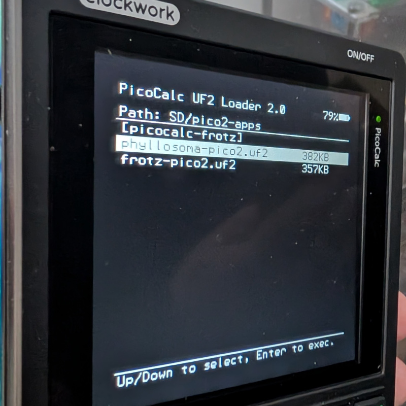

# UF2 Loader

`UF2 Loader` is a custom bootloader for the RP2040 and RP2350 on the PicoCalc. With UF2 Loader installed, applications can be loaded directly from the SD card at will without needing to plug into a PC.

<div align="center">
    
</div>

## Features

* Runs standard UF2 files built by the pico-sdk without modification (if the app does not itself write to flash)
* Can load binaries compiled with pico-sdk's `no-flash` flag into RAM and execute them without erasing the currently flashed app.
* USB Mass Storage support for accessing the SD card from a PC.

## Compilation
Clone the source code and initialize the submodules.

```bash
git clone https://github.com/pelrun/uf2loader.git
cd uf2loader
git submodule update --init --recursive
```

Build the bootloader.

```bash
PICO_SDK_PATH=/path/to/pico-sdk cmake -DPICO_BOARD=pico -B build -S .
cd build
make -j8
```

The compiled binaries will be placed in the `output/` folder.

## Installation

Copy `BOOT2040.UF2` (for Pico/Pico W) or `BOOT2350.UF2` (for Pico 2/2W) to the root of the Picocalc SD card. This is the menu UI and is loaded by the bootloader when needed.

Create `pico1-apps` (for Pico/Pico W) or `pico2-apps` (for Pico 2/2W) folders on the SD card and copy any UF2 files you want to use to them.

Pico 1 and Pico 2 files can coexist on the SD card simultaneously.

Flash `bootloader_pico.uf2` (for Pico/Pico W) or `bootloader_pico2.uf2` (Pico 2/2W) to your Pico using BOOTSEL mode or Picotool.

# Usage

If an application is already present in flash, by default it will be started immediately on power-on.

Hold Up, F1 or F5 during power-on to launch the loader menu.

If an application is present, the first item in the menu (in [square brackets]) will launch it. If the application has the appropriate Binary Information block then the name of the application will be shown here.

Hold Down or F3 during power-on to put the Pico into BOOTSEL mode.

If the menu cannot be loaded for any reason (no SD card, BOOTnnnn.UF2 not found, aliens etc) then the device will fall into BOOTSEL mode.

On the RP2350 only, UF2 files can also be written to the Pico in BOOTSEL mode or via Picotool as normal and will automatically be placed in the app partition.

To use the USB Mass Storage mode, connect the PC to the pico's micro-usb port *after* the UI has been entered. Eject or unplug the usb cable to resume using the menu.
If the Pico is connected to the PC before turning on PicoCalc, the Pico will power up before the keyboard is available and things will get confused. Unplug and power-cycle the PicoCalc, enter the menu, then connect USB.

## Technical Implementation Notes
On the RP2040, the top 16k of flash is occupied and must not be overwritten by the application. 8k is for the bootloader, and 8k is used by the bluetooth stack on the W.

As the RP2040 does not have a mechanism for write protecting flash regions, the application has to manually avoid flashing this area, and so the bootloader stores some information in the application vector table for use by the developer to know how much free flash space is available in place of the `PICO_FLASH_SIZE_BYTES` macro.

If the magic number (`0xe98cc638`) is present at `XIP_BASE+0x110`, then the word at `XIP_BASE+0x114` is the size of the safe flash area. The application is free to erase or reflash any addresses below this without affecting the bootloader.

On the RP2350, a flash partition is used, and the application can't directly overwrite (or even see) the bootloader in the normal case (please use RP2350's `rom_flash_op` instead of the old `flash_range_erase/flash_range_program` apis, which do not care about the partition table.) The application can get the size of the partition via the bootrom API. (see `bl_app_partition_get_info()` in proginfo.c for an implementation.)

## Credits
- [adwuard](https://github.com/adwuard/Picocalc_SD_Boot): Special thanks for the Picocalc SD Boot application that UF2 Loader is heavily based on.
- [Hiroyuki Oyama](https://github.com/oyama/pico-sdcard-boot): Special thanks for the bootloader that SD-Boot is based on.
- [muzkr](https://github.com/muzkr/hachi/): Special thanks for the boot2/high-mem code
- [cuu](https://github.com/clockworkpi/PicoCalc): Various UI improvements taken from their SD Boot fork
- [nipo](https://github.com/nipo/picore): Pico Binary Information parser library
- [ChaN](https://elm-chan.org/): because everyone uses their FatFS and Petit FatFS libraries. E. v. e. r. y. o. n. e.

## Read More
- Forum Page and Discussion: [Clockwork Pi Forum](https://forum.clockworkpi.com/t/uf2-loader-release/18479)
