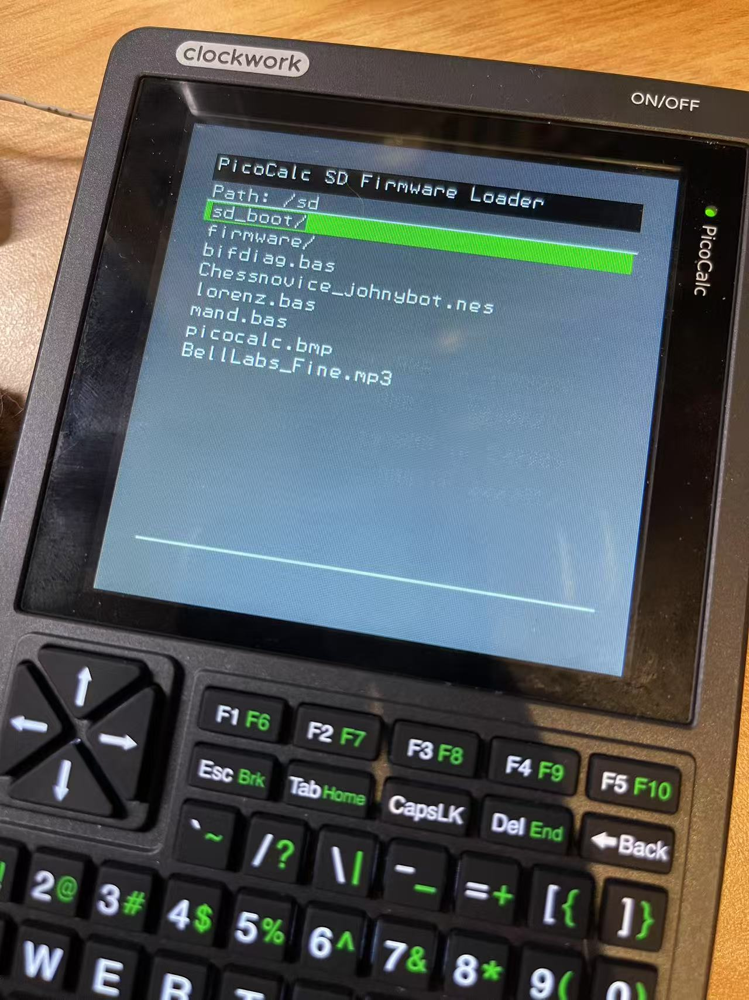

# Picocalc_SD_Boot 

`Picocalc_SD_Boot` is a custom bootloader for the Raspberry Pi Pico. This bootloader provides the functionality to load and execute applications from an SD card, designed to enable PicoCalc to load firmware to the Pico using an SD card easily.

<div align="center">
    
</div>


## Prebuilt .uf2 Firmware Available
[](https://github.com/adwuard/Picocalc_SD_Boot/tree/main/prebuild_output)

Click the button above to download the prebuilt `.uf2` firmware for the `Picocalc_SD_Boot ` bootloader. Flash your pico with holding BOOT_SEL and drag and drop the `.uf2` file.


## Bootloader Build From Scratch
Clone the source code and initialize the submodules.

```bash
git clone https://github.com/adwuard/Picocalc_SD_Boot.git
cd Picocalc_SD_Boot
git submodule update --init --recursive
```

Build the bootloader.

```bash
mkdir build; cd build
cmake ..
make
```

## SD Card Application Build and Deployment
🚨 **Important Note:** 🚨  
```
Applications intended for SD card boot "MUST REBUILD" using a custom linker script to accommodate the program's offset address. 
```
✅ You can find all the recompiled firmware available in the [sd_card_content](https://github.com/adwuard/Picocalc_SD_Boot/tree/main/sd_card_content) folder.

--- 
This section explains how to build and deploy applications on an SD card. Below is a simple example of a CMakeLists.txt for an application.


## Step 1 Copy Custom Link Script
Copy `memmap_sdcard_app.ld` to your project repository.

## Step 2 Add Custom Link Script to CMakeList.txt
```CMakeLists.txt
cmake_minimum_required(VERSION 3.13...3.27)
include(vendor/pico_sdk_import.cmake)
add_subdirectory(pico-sdcard-boot)

project(hello)
set(FAMILY rp2040)
set(CMAKE_C_STANDARD 11)
set(CMAKE_CXX_STANDARD 17)
pico_sdk_init()

add_executable(hello main.c)
target_link_libraries(hello PRIVATE pico_stdlib)
pico_enable_stdio_usb(hello 1)
pico_add_extra_outputs(hello)


# ----------- COPY THIS Section -----------
function(enable_sdcard_app target)
  #pico_set_linker_script(${target} ${CMAKE_SOURCE_DIR}/memmap_sdcard_app.ld)
  if(${PICO_PLATFORM} STREQUAL "rp2040")
    pico_set_linker_script(${CMAKE_PROJECT_NAME} ${CMAKE_SOURCE_DIR}/memmap_default_rp2040.ld)
  elseif(${PICO_PLATFORM} MATCHES "rp2350")
    pico_set_linker_script(${CMAKE_PROJECT_NAME} ${CMAKE_SOURCE_DIR}/memmap_default_rp2350.ld)
  endif()
endfunction()
# ----------- COPY THIS Section END -----------
```
The `enable_sdcard_app()` function sets the necessary `memmap_sdcard_app.ld` linker script for projects that boot from an SD card.

### Build and Deployment Process
1. Build the project using the above CMakeLists.txt.

```bash
mkdir build; cd build
PICO_SDK_PATH=/path/to/pico-sdk cmake ..
make
```

## Step 3 Your Custom Application Is Ready For SD Card Boot 
Once the build is complete, copy the generated `APP_FW.bin` file to the `/sd` directory of the SD card.


## Technical Implementation Notes
### Flash Update Mechanism
The bootloader implements a safe update mechanism with the following features:

- The bootloader itself resides in a protected flash area (first 256KB) that is never overwritten during updates
- Only the application region of flash (starting at 256KB) is updated using `flash_range_erase` and `flash_range_program`
- The bootloader verifies if the update differs from the current flash image before performing any write operations
- Flash programming operations are executed from RAM using the `__not_in_flash_func` attribute to ensure safe execution while the flash is being modified
- Program size is verified to prevent overwriting critical memory regions


### Flash Programming Safety
When updating flash memory, the code that performs the flash operations must not be executed from the flash itself. The bootloader ensures this by:

1. Using the Raspberry Pi Pico SDK's `__not_in_flash_func` attribute for all flash programming functions
2. This attribute ensures the functions are executed from RAM rather than flash
3. Without this protection, attempting to modify the flash while executing code from it could lead to unpredictable behavior or bricking the device

## Credits
- [Hiroyuki Oyama](https://github.com/oyama/pico-sdcard-boot): Special thanks for the firmware loader mechanism and VFS file system.
  - https://github.com/oyama/pico-sdcard-boot
  - https://github.com/oyama/pico-vfs
- [TheKiwil](https://github.com/TheKiwil/): Special thanks for contributions on supporting pico2 boards with new custom linker script.

## Read More
- Blog on this repository, and more technical detail about bootloader. -->[Blog Page](https://hsuanhanlai.com/writting-custom-bootloader-for-RPI-Pico/)
- Fourm Page and Discussion: [Clockwork Pi Fourm](https://forum.clockworkpi.com/t/i-made-an-app-that-dynamically-load-firmware-from-sd-card/16664/24)
